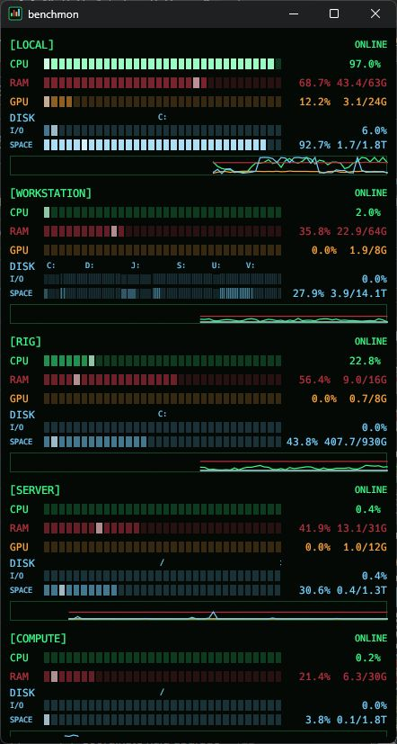

# benchmon // eyes on the machines

CPU / RAM / NVIDIA / disks. Local and SSH. One small, always-on-top Windows panel.



## > run

[Download the Windows x64 ZIP](https://github.com/Krarilotus/benchmon/releases/latest). Unzip. Run `benchmon.exe`. Pin it.

Put `hosts.txt` beside the executable:

```text
DESKTOP|local
RIG|windows|my-workstation
SERVER|linux|my-server
```

Format: `label|local` or `label|windows/linux|SSH-destination`. Use SSH aliases or `user@host`. Usernames with spaces work. `#` starts a comment. Restart after edits.

## > wire

Windows: PowerShell 5.1 + OpenSSH. Remote Windows hosts need an SSH server; Linux hosts need SSH + Python 3. NVIDIA readings use `nvidia-smi`.

Configure your keys and aliases in `~/.ssh/config`. [Windows key setup](https://learn.microsoft.com/en-us/windows-server/administration/openssh/openssh_keymanagement).

```powershell
ssh -o BatchMode=yes -o StrictHostKeyChecking=yes my-server hostname
.\benchmon.exe --check | Out-String
```

Verify host fingerprints before running the panel. `--check` prints a JSON reading per machine and exits nonzero on failure.

## > read

Green CPU. Red RAM. Orange GPU. Blue disks. Bars brighten above 50%, then harder above 80%.

Disk width follows volume capacity. **I/O** shows the busier of read/write time as a percentage. **SPACE** shows occupied capacity. Hover for per-volume numbers. Windows shows fixed drive letters; Linux shows local block filesystems. GPU uses the first NVIDIA card.

Readings: ~2s. Capacity: 30s. Graph: 90 samples. Red link: stale for 8s. Reconnect: 10s. Closing the panel ends its probes; Windows probes also exit when their SSH session disappears.

## > hack

Windows build: Rust + Visual Studio C++ Build Tools.

```powershell
cargo fmt --check
cargo clippy --all-targets --locked -- -D warnings
cargo test --locked
.\tools\test-windows-probe.ps1
.\tools\package.ps1
.\tools\install.ps1 -Destination C:\Tools\benchmon
```

ZIPs land in `dist/`. The installer remembers its destination, keeps `hosts.txt`, updates the taskbar pin, and restarts the panel. Keep your host list local.

```text
       __________          __
      |______    |       _/ /
             |   |     _/ _/
             |   |  __/ _/
             |   |_/ __/
         ____|   /  <
       _/  _     \   \__
      /___/ \____/ \_____\
             Krarilotus
```

[MIT](LICENSE)
